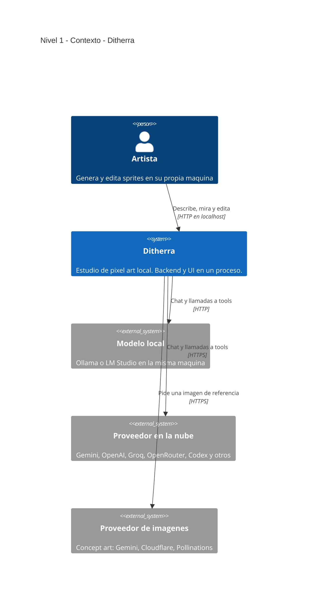
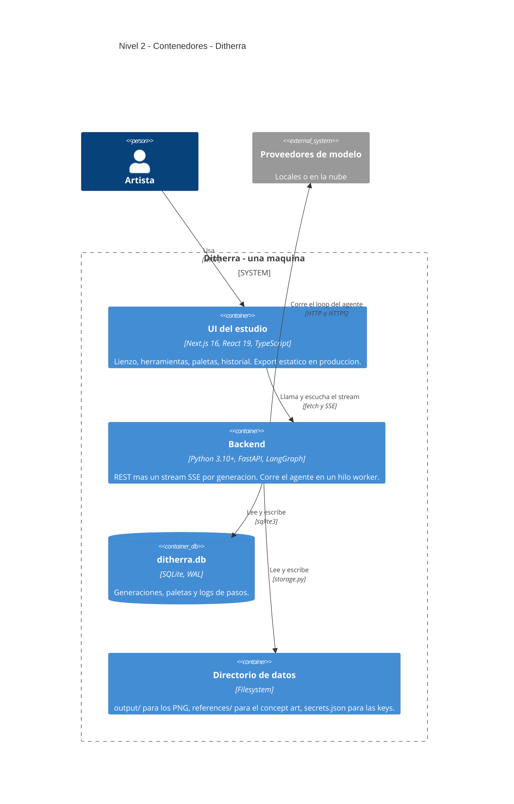
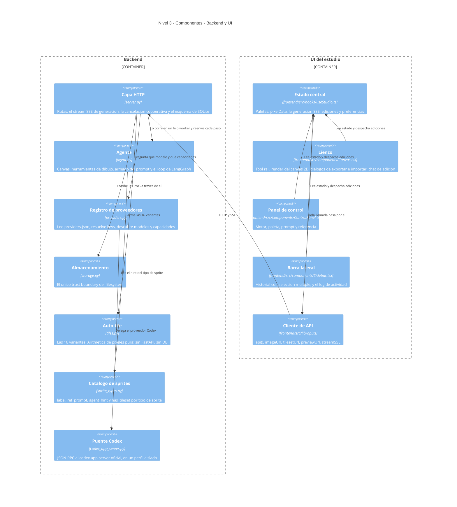

<!-- English: README.md -->

# Ditherra

Un estudio de pixel art que corre en tu propia máquina. Un agente de IA pinta el
sprite píxel por píxel mientras lo mirás, y después seguís vos: lápiz, relleno,
dither, espejo, selección, armonías de paleta, y exportar a PNG, WebP, JPG, SVG
o a un set auto-tile de 16 piezas.

Nada sale de la máquina salvo las llamadas al modelo que elijas, y con Ollama o
LM Studio ni eso.

*[Read in English](README.md)*

---

## Requisitos

| | Versión | Por qué |
|---|---|---|
| **Python** | **3.10 o superior** | Lo pide `langchain` 1.x, y el código usa anotaciones `str \| None`. macOS todavía trae 3.9 como `python3`; `start.sh` lo detecta y lo dice, en vez de fallar con un muro de versiones de pip. |
| **Node.js** | **20 o superior** | Lo pide Next.js 16. CI fija 20. |
| **Un modelo** | un proveedor, o nada | O una API key de un proveedor en la nube, o un Ollama / LM Studio local. Sin ninguno la app arranca y el editor funciona, pero no se genera ningún sprite. |

No hay base de datos que aprovisionar: SQLite se crea en el primer arranque. No hay Docker.

**Usá un modelo con visión.** El agente mira su propio lienzo entre pasos y se
corrige. Un modelo solo de texto (deepseek-chat, por ejemplo) pinta desde una
grilla de números, a ciegas, y el resultado es mucho peor.

---

## Instalación desde cero

```bash
git clone https://github.com/poncho-ajmv/Ditherra.git
cd Ditherra
cp .env.example .env      # opcional: las keys también se pueden poner desde la UI
./start.sh
```

`start.sh` crea `venv/`, instala los dos sets de dependencias, instala los
paquetes del frontend y levanta dos procesos. Abrí <http://localhost:3000>.

Para el modo empaquetado de un solo proceso — el frontend compilado a export
estático y servido por el backend desde el mismo origen:

```bash
./start.sh --build
```

Abrí <http://localhost:8500>.

Gratis y sin ninguna key:

```bash
ollama pull qwen2.5vl:7b
./start.sh
```

Si tu `python3` es anterior a 3.10 pero tenés uno más nuevo en otra parte:

```bash
DITHERRA_PYTHON=/ruta/a/python3.12 ./start.sh
```

---

## Uso

La ventana son tres columnas: controles a la izquierda, lienzo en el centro,
historial y actividad a la derecha.

1. **Motor** — elegí el modelo y el nivel de calidad.
2. **Paleta** — armala a mano, sacá armonías de un color base, o importá una
   imagen y dejá que cuantice los colores.
3. **Describir** — el prompt, el tipo de sprite (bloque, icono, personaje,
   enemigo…) y el tamaño: `8x8`, `16x16`, `32x32` o `64x64`.
4. **Referencia** *(opcional)* — generá concept art primero y que el agente
   pinte contra eso.

Después generás. El lienzo se actualiza en cada paso, el panel de actividad
registra con hora lo que hizo el modelo, y **Cancelar** lo detiene antes de la
siguiente llamada — o sea que deja de gastar.

Cuando termina, el sprite es tuyo para editar. Cada cambio se guarda.

### Niveles de calidad

| Nivel | Pasos | Preview |
|---|---|---|
| Borrador | 25 | No — pinta a ciegas |
| Normal | 80 | Sí |
| Alta | 120 | Sí |
| Máxima | sin techo | Sí, más un bucle de revisión contra criterios de pixel art |

La calidad viene de los pasos: más pasos son más pasadas de mirar y corregir.

### Teclado

| Tecla | Herramienta | | Tecla | Herramienta |
|---|---|---|---|---|
| `B` | Lápiz | | `L` | Línea |
| `E` | Goma | | `R` | Rectángulo |
| `G` | Relleno | | `C` | Círculo |
| `I` | Cuentagotas | | `M` | Selección |
| `D` | Dither | | `H` | Mano |

`Cmd/Ctrl+Z` deshacer, `Cmd/Ctrl+Y` rehacer, `Cmd/Ctrl+C` y `Cmd/Ctrl+V` sobre
una selección, `Delete` la limpia, las flechas la mueven, `Escape` la suelta.

---

## Configuración

Las keys van en `.env`, o en el panel de Configuración de la app — que las
escribe en `secrets.json`. El entorno gana sobre el archivo. Una key se puede
**probar antes de guardarla**: la candidata viaja al backend y nunca se escribe.

| Variable | Default | Qué hace |
|---|---|---|
| `DITHERRA_DATA` | el repo mismo | Raíz de `output/`, `references/`, `ditherra.db` y `secrets.json`. Una sola respuesta a "dónde están mis datos". |
| `DITHERRA_LLM_TIMEOUT` | `600` | Segundos que puede tardar **una** llamada al modelo. Generoso porque un modelo local en una laptop tarda minutos de forma legítima; finito porque sin él un proveedor colgado dejaba el job vivo para siempre. |
| `DITHERRA_PYTHON` | autodetectado | Intérprete que debe usar `start.sh`. |
| `DITHERRA_CODEX_HOME` | — | Perfil de Codex aislado, para que la app nunca toque `~/.codex/auth.json`. |
| `HOST` / `PORT` | `127.0.0.1` / `8500` | `HOST=0.0.0.0` sin `API_KEY` se rechaza a propósito. |
| `API_KEY` | — | Obligatoria para exponer el backend fuera de localhost. |
| `CORS_ORIGINS` | — | Orígenes permitidos extra. |

Las keys de proveedor usan la variable de cada uno (`GEMINI_API_KEY`,
`OPENAI_BASE_URL`, `CLOUDFLARE_ACCOUNT_ID`…). `.env.example` las lista todas con
un comentario cada una. Los **valores** nunca van en el README, y `.env` y
`secrets.json` están gitignored.

Proveedores incluidos: **locales** — ollama, lmstudio. **Nube** — gemini, openai,
deepseek, qwen, qwen-vl, glm, kimi, groq, openrouter, codex.

---

## Arquitectura (modelo C4)

Los diagramas están en Mermaid, así que GitHub, GitLab y VS Code los dibujan sin
instalar nada. La sintaxis nativa `C4Context` / `C4Container` / `C4Component`
sigue marcada como experimental upstream, así que la cantidad de elementos por
diagrama se mantiene baja a propósito.

### Nivel 1 — Contexto

Una persona, un proceso local, y el proveedor de modelo que haya elegido. El
proveedor es lo único fuera de la máquina, y elegir uno local lo saca del todo.



### Nivel 2 — Contenedores

Dos contenedores en desarrollo, uno en producción. `./start.sh --build` compila
la UI en `static/` y el backend la sirve desde el mismo origen, así que queda un
solo proceso y no hay CORS.



### Nivel 3 — Componentes

Cada componente de abajo es una ruta real del repositorio.



---

## Decisiones que vale explicar

**Cancelar tiene que dejar de gastar de verdad.** `/cancel` agrega el id a un
set, y al agente se le pasa un `cancel_check` que consulta *entre pasos*. Una
llamada en curso no se puede interrumpir, pero la siguiente nunca ocurre. Marcar
la fila como `canceled` en la base y dejar que el loop termine eran tres líneas
y seguía facturando.

**El agente solo ve el lienzo más reciente.** Un pre-model hook
(`_drop_stale_canvas_views`) convierte en stub toda vista vieja del canvas en el
hilo. Ahorra tokens, y sobre todo evita que el modelo razone sobre dos
snapshots contradictorios del mismo sprite.

**La calidad `máxima` cambia las instrucciones, no el número.** Saca el techo de
pasos y activa un bucle de revisión, y `finish` hay que ganárselo mirando el
canvas. Subir solo `max_steps` hacía las generaciones más largas, no mejores.

**Normal son 80 pasos porque es el baseline del original.** Una época estuvo en
55 y la calidad bajó de forma visible. El número no es arbitrario y no se toca
sin mirar el resultado.

**El catálogo de tipos de sprite es un solo archivo.** Antes eran dos dicts
paralelos en dos archivos sin nada que los sincronizara, que es un bug esperando
al próximo tipo de sprite.

**Deepseek más un crítico de visión barato se construyó y se descartó.**
Prestarle "ojos" a un modelo de texto funciona, pero duplica las llamadas y la
crítica en texto es un cuello de botella lossy. Un solo modelo con visión es más
simple y da mejor resultado.

**Codex entra por el app-server oficial.** Sin extraer tokens ni usar endpoints
internos. Se conecta con el OAuth normal de ChatGPT a un `CODEX_HOME` que es de
Ditherra, así que la sesión personal del CLI queda separada.

**El lienzo se redibuja completo cuando cambia el tamaño de display.** Redibujar
solo las celdas que cambiaron es más rápido, pero el buffer lo redimensiona el
redibujado completo; saltearlo en un zoom estira el buffer viejo y el sprite sale
borroso y desalineado.

---

## Qué NO viene en el repositorio

`.gitignore` los deja fuera. Nada de esto hay que recuperar a mano:

| Ruta | Cómo vuelve |
|---|---|
| `venv/`, `__pycache__/` | `./start.sh`, o `pip install -r requirements.txt` |
| `frontend/node_modules/`, `frontend/.next/` | `cd frontend && npm ci` |
| `static/` | `cd frontend && npm run build` |
| `ditherra.db`, `output/`, `references/` | Se crean en el primer arranque |
| `.env`, `secrets.json` | `cp .env.example .env`, o el panel de Configuración |
| `CLAUDE.md`, `AGENTS.md`, `docs/` | Notas locales. Este README se basta solo. |

---

## Estructura del proyecto

```
server.py               FastAPI: rutas, SSE, esquema de SQLite
agent.py                Canvas, herramientas de dibujo, prompts, loop de LangGraph
providers.py            Registro de proveedores, keys y descubrimiento de capacidades
providers.json          Definición de proveedores: kind, base_url, models, vision
sprite_types.py         Catálogo de tipos de sprite
tiles.py                Las 16 variantes auto-tile
storage.py              El trust boundary del filesystem
codex_app_server.py     Puente JSON-RPC a codex app-server
start.sh                Setup y arranque en un comando
tests/                  Suite del backend, aislada contra un tmpdir
frontend/
├── src/app/            layout.tsx y page.tsx
├── src/components/     Canvas, ControlPanel, Sidebar, SettingsDialog, PixelIcon, Splitter
├── src/hooks/          useStudio.ts — estado central
└── src/lib/            api, harmony, imageImport, pixelOps, zip, i18n, types
```

---

## Idiomas

La UI viene en nueve: inglés, español, francés, portugués, alemán, ruso, japonés,
chino y coreano. `frontend/src/lib/i18n.ts` los tiene todos, con `en` como fuente
de verdad — una clave que falte cae a inglés en vez de renderizar vacío.

---

## Comprobar que funciona

```bash
pip install -r requirements.txt -r requirements-dev.txt
pytest -q                  # suite del backend
python providers.py        # el registro carga y ningún id de modelo está muerto
```

```bash
cd frontend
npm ci
npx tsc --noEmit
npm run build
```

`tests/conftest.py` apunta `DITHERRA_DATA` a un tmpdir y limpia las keys de
proveedor, así que la suite nunca toca sprites reales y nunca gasta crédito real.

GitHub Actions corre todo lo de arriba en cada push y pull request.

---

## Seguridad

La app está hecha para correr en `127.0.0.1`. No hay RCE, ni SQL injection, ni
path traversal, ni secretos en git. Lo que sí vale saber:

- **Escuchar en `0.0.0.0` sin `API_KEY` se rechaza.** Exponer el backend exige
  poner una key a propósito.
- **`storage.py` es el único trust boundary del filesystem.** Toda ruta que la
  app escribe se resuelve por ahí, debajo de `DITHERRA_DATA`.
- **Los uploads tienen límite de tamaño y se validan** abriéndolos con PIL, en
  vez de confiar en la extensión.
- **Una key se puede probar sin guardarla.** La candidata se manda, se usa para
  un sondeo, y se descarta.
- **Seis endpoints POST no tienen body y por eso no tienen protección CSRF**
  (`server.py:818, 1067, 1077, 1199, 1207, 1234`). Los que tienen body Pydantic
  sí están cubiertos. Un middleware que chequee `Origin` cierra los seis de una;
  es lo único con peso real que queda acá.
- Menores, todos solo en local: `api_key` también se acepta por query string y se
  compara sin `compare_digest`; la service account de Google se escribe en una
  ruta predecible bajo `/tmp`; no hay validación de `Host` ni `nosniff`.

---

## Estado del proyecto

**Funciona:** la generación con progreso en vivo y cancelación real, el editor de
píxeles completo, paletas y armonías, importar y cuantizar imágenes, todos los
formatos de export, el set auto-tile de 16 piezas, el historial local, los nueve
idiomas, los dos temas, y todos los proveedores listados arriba.

**Falta o conviene saber:**

- **El hilo worker no se cancela.** El stream ya no miente sobre cuándo terminó
  una generación, pero cerrar la pestaña o borrar el sprite no detiene el hilo.
  Desconectarte deja el job huérfano y el gasto sigue.
- **`manual_pixel_update` es un read-modify-write sin transacción**
  (`server.py:1010`). Dos ediciones concurrentes, o una edición durante una
  generación, pierden píxeles.
- **`finalize` compite con el worker** (`server.py:1099`): escribe el PNG y pone
  `complete`, y el worker vivo lo pisa después.
- **Continuar después de un reinicio pierde la referencia.** `is_continuation` lo
  decide el caller y `is_new` el agente contra el checkpointer en memoria; tras
  un restart se re-siembra el prompt con `reference_b64=None` y el agente repinta
  ignorando el concept art. Los dos flags tienen que ser uno.
- **Sin soporte táctil** (`Canvas.tsx:907`): solo eventos de mouse, así que en
  tablet no se puede dibujar. Pasar a Pointer Events es cambiar nombres.
- **Ningún test cubre el flujo de generación**, que es justo donde viven los
  puntos de arriba. Un test con un LLM falso que devuelva tres tool calls cubre
  de una el rescate del canvas, la cancelación, el timeout y la carrera de
  `finalize`.
- **19 errores de eslint**, casi todos `catch (e: any)`, así que `npm run lint`
  todavía no está en CI.
- **Quedan tres strings en español hardcodeadas**: `Sidebar.tsx:186`,
  `page.tsx:52` y las etiquetas `"base"` de `harmony.ts`. Las notas de proveedor
  salen de `providers.json` en inglés y tampoco se traducen.
- **`Canvas.tsx` va por las 1470 líneas.** El corte natural es `ExportDialog.tsx`
  e `ImportDialog.tsx`, sin tocar el estado.

---

## Solución de problemas

**`[Errno 48] Address already in use`.** Una corrida anterior dejó al hijo del
reloader agarrado al puerto. `start.sh` recupera sus propios restos, pero solo
procesos que parecen de Ditherra; cualquier otra cosa se deja en paz y hay que
cerrarla a mano.

**La generación se corta y la UI no dice nada.** Editar `server.py` o `agent.py`
mientras se pinta un sprite reinicia el reloader de uvicorn y mata la corrida.
No hay nada en la UI que lo explique. Esperá a que termine antes de tocar el
backend.

**El sprite sale mal con un modelo que debería poder.** Fijate si tiene visión.
Sin ella el agente pinta desde una grilla de números y no puede ver sus errores.

**El tier gratis de Gemini se agota como en un sprite por día** (20 requests). El
agente hace entre 25 y 80 llamadas por sprite. O activás billing —cuesta
centavos— o corrés Ollama local, que es gratis y sin límites.

**`test_connection` devuelve `no_endpoint` para Gemini.** No es una falla: Gemini
va por el SDK de Google y no tiene `/models` que sondear, así que la key se
valida al generar.

**Mis cambios del frontend no aparecen.** `./start.sh --build` sirve un export
compilado. Usá `./start.sh`, que es el default, mientras editás la UI.

---

## Licencia

Ver [LICENSE](LICENSE).

Ditherra es un derivado de [Texel Studio](https://github.com/EYamanS/texel-studio)
de Emir Yaman Sivrikaya y todavía contiene una parte sustancial de su código, así
que sus términos rigen todo el proyecto: podés usarlo, modificarlo y
auto-hospedarlo libremente, incluso comercialmente, pero no podés ofrecerlo como
servicio hospedado que compita con texel.studio. Todo lo que generes con él es
enteramente tuyo.

El proyecto se está reescribiendo desde cero; la licencia se revisa cuando eso
esté hecho.

---

## Sobre esto

Hecho por [poncho-ajmv](https://github.com/poncho-ajmv).
Los iconos son [Pixelarticons](https://pixelarticons.com/).
