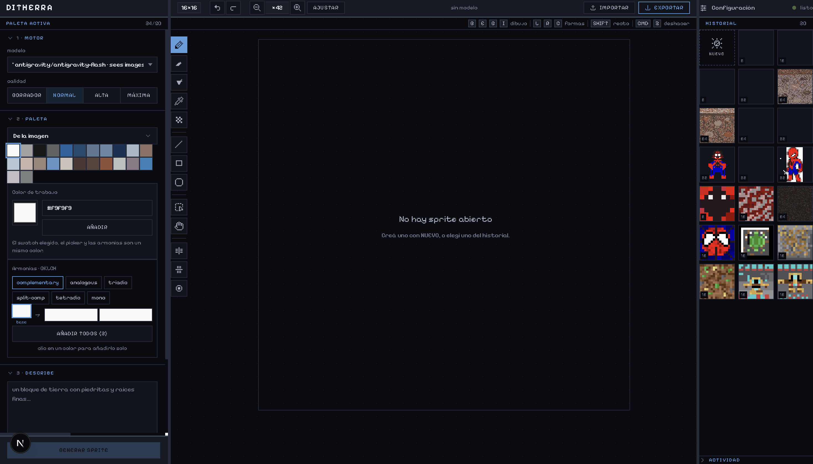
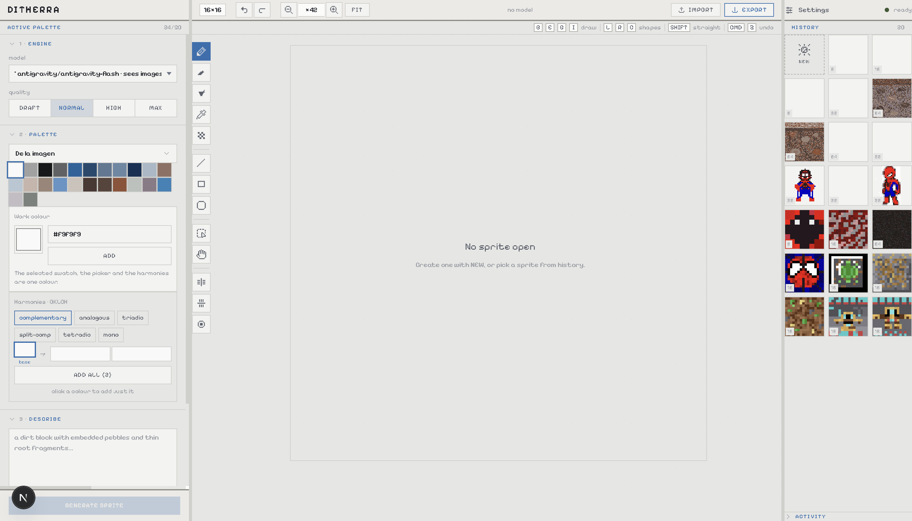
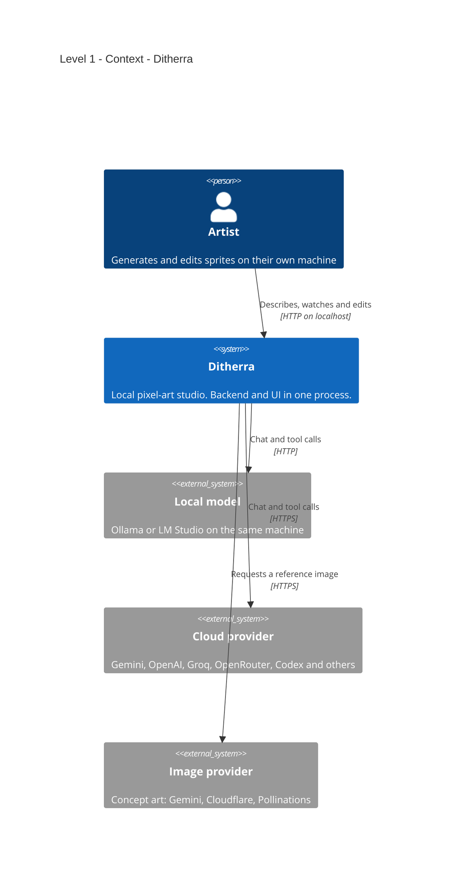
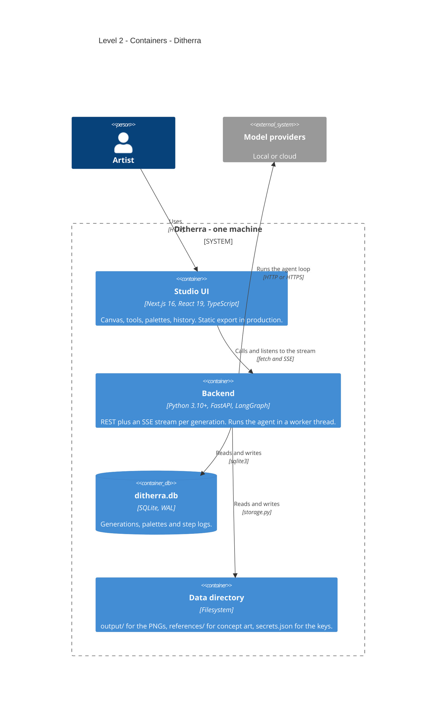
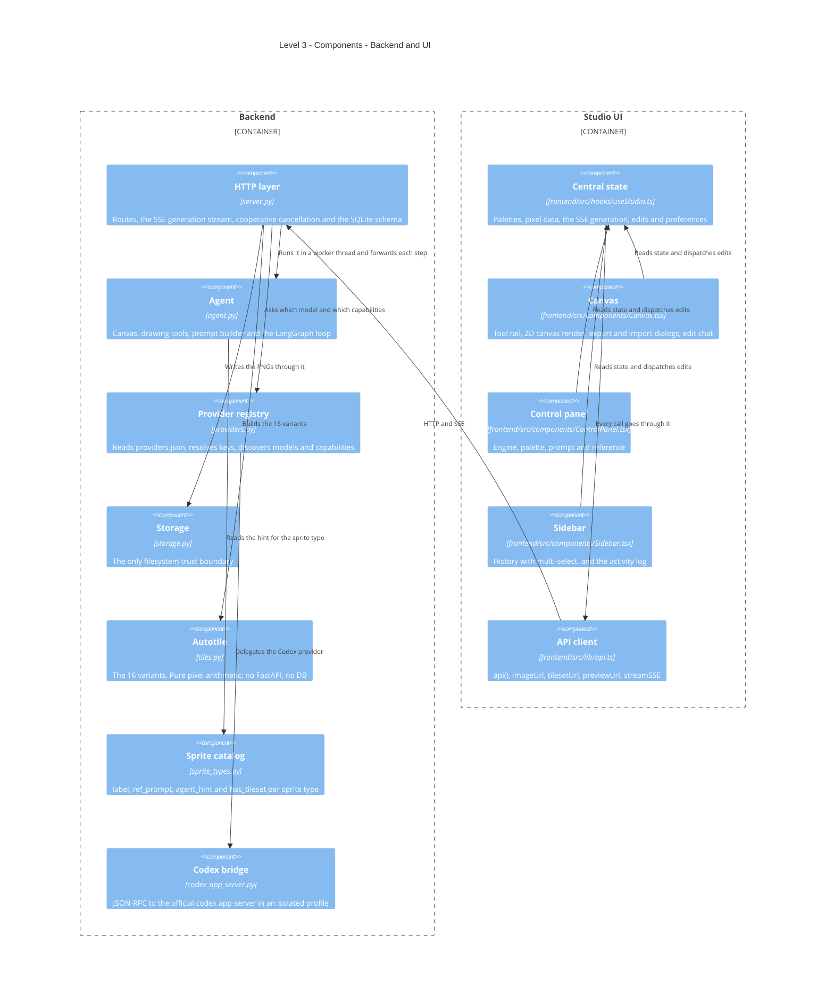

<!-- Español: README.es.md -->

# Ditherra

A pixel-art studio that runs on your own machine. An AI agent paints the sprite
one pixel at a time while you watch, and then you take over: pencil, bucket,
dither, mirror, selection, palette harmonies, and export to PNG, WebP, JPG, SVG
or a 16-tile autotile set.

Nothing leaves the machine except the calls to whichever model you point it at,
and with Ollama or LM Studio not even those.

*[Leer en español](README.es.md)*

## Preview

The Ditherra workspace: controls and palette on the left, the pixel canvas in
the center, and history and activity on the right. It includes dark and light
themes.

[](assets/screenshots/ditherra-interface-dark.png)

[](assets/screenshots/ditherra-interface-light.png)

---

## Requirements

| | Version | Why |
|---|---|---|
| **Python** | **3.10 or newer** | `langchain` 1.x needs it, and the code uses `str \| None` annotations. macOS still ships 3.9 as `python3`; `start.sh` detects this and says so instead of failing on a wall of pip versions. |
| **Node.js** | **20 or newer** | Required by Next.js 16. CI pins 20. |
| **A model** | one provider, or nothing | Either an API key for a cloud provider, or a local Ollama / LM Studio. Without one the app runs and the editor works, but no sprite gets generated. |

No database to provision: SQLite is created on first run. No Docker.

**Use a model with vision.** The agent looks at its own canvas between steps and
corrects itself. A text-only model (deepseek-chat, for example) paints from a
grid of numbers, blind, and the result is much worse.

---

## Install from scratch

```bash
git clone https://github.com/poncho-ajmv/Ditherra.git
cd Ditherra
cp .env.example .env      # optional: keys can also be added from the UI
./start.sh
```

`start.sh` creates `venv/`, installs both dependency sets, installs the frontend
packages and starts two processes. Open <http://localhost:3000>. The packaged
single-process mode is `./start.sh --build`, covered below.

Free and with no key at all:

```bash
ollama pull qwen2.5vl:7b
./start.sh
```

If `python3` is older than 3.10 but you have a newer one elsewhere:

```bash
DITHERRA_PYTHON=/path/to/python3.12 ./start.sh
```

---

## Running it

`start.sh` is the only command needed. There is nothing to activate by hand: it
finds a Python 3.10+, creates `venv/`, installs both dependency sets and the
frontend packages, frees port 8500 if a previous run left it held, and starts
the app. A second run reuses everything and just starts.

| Command | Port | What it is |
|---|---|---|
| `./start.sh` | <http://localhost:3000> | Development, the default. Next watches the files and pushes changes into the open page. The API is on 8500. |
| `./start.sh --build` | <http://localhost:8500> | Packaged mode. The UI is compiled into `static/` and the backend serves it same-origin, so it is one process and there is no CORS. |

Use the default while editing the interface. `--build` serves a compiled export,
so UI changes only appear after a rebuild — and that is exactly the "my changes
do not show up" confusion.

`Ctrl+C` stops both processes.

---

## Usage

The window is three columns: controls on the left, canvas in the middle, history
and activity on the right.

1. **Engine** — pick the model and the quality level.
2. **Palette** — build one by hand, pull harmonies from a base color, or import
   an image and let it quantize the colors for you.
3. **Describe** — the prompt, the sprite type (block, icon, character, enemy…)
   and the size: `8x8`, `16x16`, `32x32` or `64x64`.
4. **Reference** *(optional)* — generate concept art first and let the agent
   paint against it.

Then generate. The canvas updates on every step, the activity panel logs what
the model did with a timestamp, and **Cancel** stops it before the next model
call — so it stops spending.

When it finishes, the sprite is yours to edit. Every change is saved.

### Quality levels

| Level | Steps | Preview |
|---|---|---|
| Draft | 25 | No — it paints blind |
| Normal | 80 | Yes |
| High | 120 | Yes |
| Max | no ceiling | Yes, plus a review loop against pixel-art criteria |

Quality comes from the steps: more steps means more look-and-fix passes.

### Keyboard

| Key | Tool | | Key | Tool |
|---|---|---|---|---|
| `B` | Pencil | | `L` | Line |
| `E` | Eraser | | `R` | Rectangle |
| `G` | Bucket | | `C` | Circle |
| `I` | Eyedropper | | `M` | Select |
| `D` | Dither | | `H` | Pan |

`Cmd/Ctrl+Z` undo, `Cmd/Ctrl+Y` redo, `Cmd/Ctrl+C` and `Cmd/Ctrl+V` on a
selection, `Delete` clears it, arrows nudge it, `Escape` drops it.

---

## Configuration

Keys go in `.env`, or in the app's Settings panel — which writes them to
`secrets.json`. The environment wins over the file. A key can be **tested before
it is saved**: the candidate travels to the backend and is never written.

| Variable | Default | What it does |
|---|---|---|
| `DITHERRA_DATA` | the repo itself | Root for `output/`, `references/`, `ditherra.db` and `secrets.json`. One answer to "where is my data". |
| `DITHERRA_LLM_TIMEOUT` | `600` | Seconds a single model call may take. Generous because a local model on a laptop legitimately takes minutes; finite because without it a hung provider left the job alive forever. |
| `DITHERRA_PYTHON` | autodetected | Interpreter `start.sh` should use. |
| `DITHERRA_CODEX_HOME` | — | Isolated Codex profile, so the app never touches `~/.codex/auth.json`. |
| `HOST` / `PORT` | `127.0.0.1` / `8500` | `HOST=0.0.0.0` without `API_KEY` is refused on purpose. |
| `API_KEY` | — | Required to expose the backend outside localhost. |
| `CORS_ORIGINS` | — | Extra allowed origins. |

Provider keys use each provider's own variable (`GEMINI_API_KEY`,
`OPENAI_BASE_URL`, `CLOUDFLARE_ACCOUNT_ID`…). `.env.example` lists all of them
with a comment each. Values never go in the README, and `.env` and
`secrets.json` are gitignored.

Providers included: **local** — ollama, lmstudio. **Cloud** — gemini, openai,
deepseek, qwen, qwen-vl, glm, kimi, groq, openrouter, codex.

---

## Architecture (C4 model)

Diagrams are Mermaid, so GitHub, GitLab and VS Code draw them with nothing
installed. The native `C4Context` / `C4Container` / `C4Component` syntax is
still experimental upstream, so the element count per diagram is kept low on
purpose.

### Level 1 — Context

One person, one local process, and whichever model provider they chose. The
provider is the only thing outside the machine, and picking a local one removes
it entirely.



### Level 2 — Containers

Two containers in development, one in production. `./start.sh --build` compiles
the UI into `static/` and the backend serves it same-origin, so there is a
single process and no CORS.



### Level 3 — Components

Every component below is a real path in the repository.



---

## Decisions worth explaining

**Cancelling has to actually stop the spending.** `/cancel` adds the id to a set,
and the agent is handed a `cancel_check` it consults *between steps*. A call
already in flight cannot be interrupted, but the next one never happens. Marking
the row `canceled` in the database and letting the loop finish would have been
three lines and would have kept billing.

**The agent only ever sees the newest canvas.** A pre-model hook
(`_drop_stale_canvas_views`) turns every older canvas view in the thread into a
stub. It saves tokens, and more importantly it stops the model from reasoning
about two contradictory snapshots of the same sprite.

**`max` quality changes the instructions, not the number.** It removes the step
ceiling and turns on a review loop, and `finish` has to be earned by looking at
the canvas. Raising `max_steps` alone made generations longer, not better.

**Normal is 80 steps because that is the upstream baseline.** It once sat at 55
and quality visibly dropped. The number is not arbitrary and should not be tuned
without looking at output.

**The sprite type catalog is one file.** It used to be two parallel dicts in two
files with nothing keeping them in sync, which is a bug waiting for the next
sprite type.

**Deepseek plus a cheap vision critic was built and rejected.** Lending "eyes" to
a text model works, but it doubles the calls and the critique is a lossy text
bottleneck. One vision model is simpler and better.

**Codex goes through the official app-server.** No token extraction, no internal
endpoints. It logs in with normal ChatGPT OAuth into a `CODEX_HOME` that belongs
to Ditherra, so the personal CLI session stays separate.

**The canvas redraws fully whenever the display size changes.** Diffing only the
changed cells is faster, but the buffer is resized by the full redraw; skipping
it on a zoom stretches the old buffer and the sprite goes blurry and misaligned.

---

## What is NOT in the repository

`.gitignore` keeps these out. Nothing here needs to be recovered by hand:

| Path | How it comes back |
|---|---|
| `venv/`, `__pycache__/` | `./start.sh`, or `pip install -r requirements.txt` |
| `frontend/node_modules/`, `frontend/.next/` | `cd frontend && npm ci` |
| `static/` | `cd frontend && npm run build` |
| `ditherra.db`, `output/`, `references/` | Created on first run |
| `.env`, `secrets.json` | `cp .env.example .env`, or the Settings panel |
| `CLAUDE.md`, `AGENTS.md`, `docs/` | Local notes. This README is self-contained. |

---

## Project structure

```
server.py               FastAPI: routes, SSE, SQLite schema
agent.py                Canvas, drawing tools, prompts, LangGraph loop
providers.py            Provider registry, keys and capability discovery
providers.json          Provider definitions: kind, base_url, models, vision
sprite_types.py         Sprite type catalog
tiles.py                The 16 autotile variants
storage.py              The filesystem trust boundary
codex_app_server.py     JSON-RPC bridge to codex app-server
start.sh                One-command setup and start
assets/screenshots/     The README images
tests/                  Backend suite, isolated against a tmpdir
frontend/
├── src/app/            layout.tsx and page.tsx
├── src/components/     Canvas, ControlPanel, Sidebar, SettingsDialog, PixelIcon, Splitter
├── src/hooks/          useStudio.ts — central state
└── src/lib/            api, harmony, imageImport, pixelOps, zip, i18n, types
```

---

## Languages

The UI ships in nine: English, Spanish, French, Portuguese, German, Russian,
Japanese, Chinese and Korean. `frontend/src/lib/i18n.ts` holds all of them, with
`en` as the source of truth — a missing key falls back to English rather than
rendering blank.

---

## Verifying that it works

```bash
pip install -r requirements.txt -r requirements-dev.txt
pytest -q                 # backend suite
python providers.py        # the provider registry loads and no model id is dead
```

```bash
cd frontend
npm ci
npx tsc --noEmit
npm run build
```

`tests/conftest.py` points `DITHERRA_DATA` at a tmpdir and clears the provider
keys, so the suite never touches real sprites and never spends real credit.

GitHub Actions runs all of the above on every push and pull request.

---

## Security

The app is built to run on `127.0.0.1`. There is no RCE, no SQL injection, no
path traversal and no secret in git. What is worth knowing:

- **Binding to `0.0.0.0` without `API_KEY` is refused.** Exposing the backend
  requires setting a key on purpose.
- **`storage.py` is the only filesystem trust boundary.** Every path the app
  writes resolves through it, under `DITHERRA_DATA`.
- **Uploads are size-limited and validated** by opening them with PIL, instead
  of trusting the extension.
- **A key can be tested without being stored.** The candidate is sent, used for
  one probe, and dropped.
- **Six POST endpoints have no body and therefore no CSRF protection**
  (`server.py:818, 1067, 1077, 1199, 1207, 1234`). The ones with a Pydantic body
  are covered. A middleware checking `Origin` closes all six at once; it is the
  one real item left here.
- Minor, all local-only: `api_key` is also accepted as a query string and
  compared without `compare_digest`; the Google service account is written to a
  predictable path under `/tmp`; there is no `Host` validation and no `nosniff`.

---

## Project status

**Working:** generation with live progress and real cancellation, the full pixel
editor, palettes and harmonies, image import and quantization, all export
formats, the 16-tile autotile set, local history, the nine languages, both
themes, and every provider listed above.

**Missing or worth knowing:**

- **The worker thread is not cancelled.** The stream no longer lies about when a
  generation ended, but closing the tab or deleting the sprite does not stop the
  thread. Disconnecting leaves the job orphaned and the spending continues.
- **`manual_pixel_update` is a read-modify-write with no transaction**
  (`server.py:1010`). Two concurrent edits, or an edit during a generation, lose
  pixels.
- **`finalize` races the worker** (`server.py:1099`): it writes the PNG and sets
  `complete`, and the live worker overwrites it afterwards.
- **Continuing after a restart loses the reference.** `is_continuation` is
  decided by the caller and `is_new` by the agent against the in-memory
  checkpointer; after a restart the prompt is re-seeded with `reference_b64=None`
  and the agent repaints ignoring the concept art. The two flags should be one.
- **No touch support** (`Canvas.tsx:907`): mouse events only, so a tablet cannot
  draw. Moving to Pointer Events is a rename.
- **No test covers the generation flow**, which is exactly where the items above
  live. One test with a fake LLM returning three tool calls would cover the
  canvas rescue, cancellation, the timeout and the `finalize` race at once.
- **19 eslint errors**, nearly all `catch (e: any)`, so `npm run lint` is not
  wired into CI yet.
- **Three Spanish strings are still hardcoded**: `Sidebar.tsx:186`,
  `page.tsx:52` and the `"base"` labels in `harmony.ts`. Provider notes come from
  `providers.json` in English and are not translated either.
- **`Canvas.tsx` is around 1470 lines.** The natural split is `ExportDialog.tsx`
  and `ImportDialog.tsx`, with no change to the state.

---

## Troubleshooting

**`[Errno 48] Address already in use`.** A previous run left the reloader child
holding the port. `start.sh` reclaims its own leftovers, but only processes that
look like Ditherra's; anything else is left alone and has to be closed by hand.

**Generation stops and the UI says nothing.** Editing `server.py` or `agent.py`
while a sprite is being painted restarts uvicorn's reloader and kills the run.
There is nothing in the UI explaining it. Wait for the generation to finish
before touching the backend.

**The sprite comes out bad with a model that should be capable.** Check whether
it has vision. Without it the agent paints from a grid of numbers and cannot see
its own mistakes.

**Gemini free tier runs out after about one sprite a day** (20 requests). The
agent makes 25 to 80 calls per sprite. Either enable billing — it costs cents —
or run Ollama locally, which is free with no limits.

**`test_connection` returns `no_endpoint` for Gemini.** Not a failure: Gemini
goes through Google's SDK and has no `/models` to probe, so the key is validated
when generating.

**My frontend changes do not show up.** `./start.sh --build` serves a compiled
export. Use `./start.sh`, which is the default, while editing the UI.

---

## License

See [LICENSE](LICENSE).

Ditherra is a derivative of [Texel Studio](https://github.com/EYamanS/texel-studio)
by Emir Yaman Sivrikaya and still contains a substantial part of its code, so its
terms govern the whole project: you may use, modify and self-host it freely,
including commercially, but you may not offer it as a hosted service that
competes with texel.studio. Anything you generate with it is entirely yours.

The project is being rewritten from scratch; the license will be revisited when
that is done.

---

## About

Built by [poncho-ajmv](https://github.com/poncho-ajmv).
Icons are [Pixelarticons](https://pixelarticons.com/).
